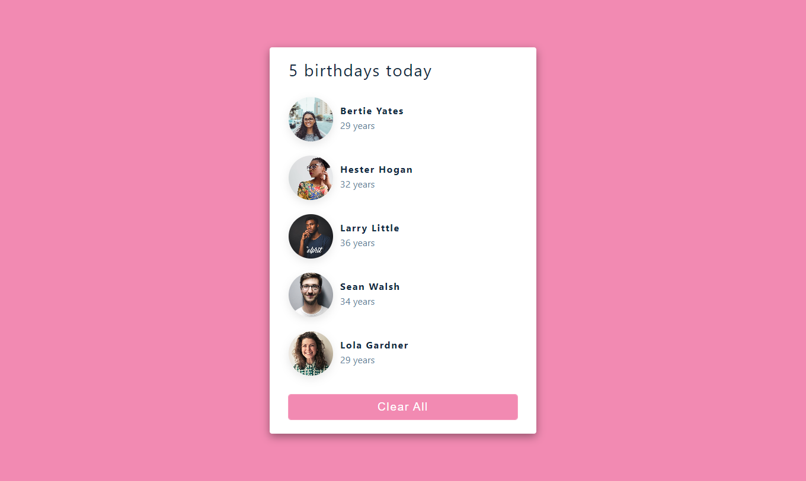

# Birthday reminder

This is a solution to the [birthday reminder on Youtube](https://www.youtube.com/watch?v=a_7Z7C_JCyo&t=438s).

## Table of contents

- [Overview](#overview)
  - [The challenge](#the-challenge)
  - [Links](#links)
- [My process](#my-process)
  - [Built with](#built-with)
- [Author](#author)

## Overview

### The challenge

Users should be able to:

- View the optimal layout for the component depending on their device's screen size.
- Hide the birthday's list when the button is clicked.

### Links

- Solution URL: [Github](https://github.com/MrBlackvanta/Birthday-reminder)

### Built with

- [React](https://reactjs.org/) - JS library
- [Sass Modules](https://sass-lang.com/) - For styles

## Author

- Frontend Mentor - [@MrBlackvanta](https://www.frontendmentor.io/profile/MrBlackvanta)
- GitHub - [@MrBlackvanta](https://github.com/MrBlackvanta)
